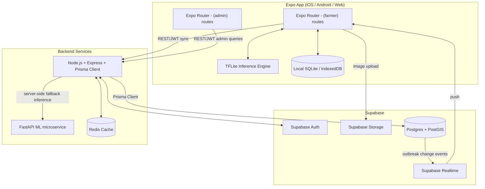

# System Architecture

## 1. Architecture Style
Edge-heavy client-server architecture with a managed backend-as-a-service core, plus a dedicated ML microservice for anything the edge model can't do.
- **Client**: One Expo (React Native + Expo Router) app, compiled to iOS, Android, and Web. Farmer flows are mobile-first; the admin dashboard is a web-optimized route group in the same app.
- **Backend**: Supabase — Postgres (with PostGIS), Auth, Storage, Realtime — fronted by a thin Node.js/Express layer for logic that doesn't belong in the database.
- **ML**: TFLite on-device for offline inference; a small FastAPI microservice for server-side fallback/heavier models.

## 2. Technology Stack
- **Client**: Expo (React Native, Expo Router), React Native Web, Vision Camera, NativeWind, SQLite / IndexedDB
- **Backend API**: Node.js, Express.js, Prisma Client
- **Database**: Supabase Postgres (PostGIS extension enabled)
- **Auth**: Supabase Auth (phone OTP) or Passport-issued JWT
- **ML/AI**: TensorFlow Lite (on-device), FastAPI microservice (server fallback)
- **Cache**: Redis

## 3. High-Level Design (HLD)

## 4. Hybrid AI Flow (Server-Side Fallback)
1. Image uploaded to Supabase Storage; the API receives the storage path (not the raw file).
2. API calls the FastAPI ML microservice over HTTP with the storage path.
3. ML service downloads the image, runs inference, returns confidence scores.
4. API applies the clinical rule engine.
5. Scores blended (70% vision / 30% symptoms) and written via Prisma Client.

## 5. Failure Modes & Graceful Degradation
- **Supabase unreachable**: the app is offline-first by design — farmers keep diagnosing locally; sync queues until connectivity + Supabase are both back.
- **Partial sync failure**: `/predict/sync` reports per-record success/failure, not all-or-nothing.
- **ML microservice down**: `/predict/analyze` fails over to “on-device result stands as final” rather than blocking the farmer.
- **Redis down**: reads fall through to Postgres directly (slower, not broken).
