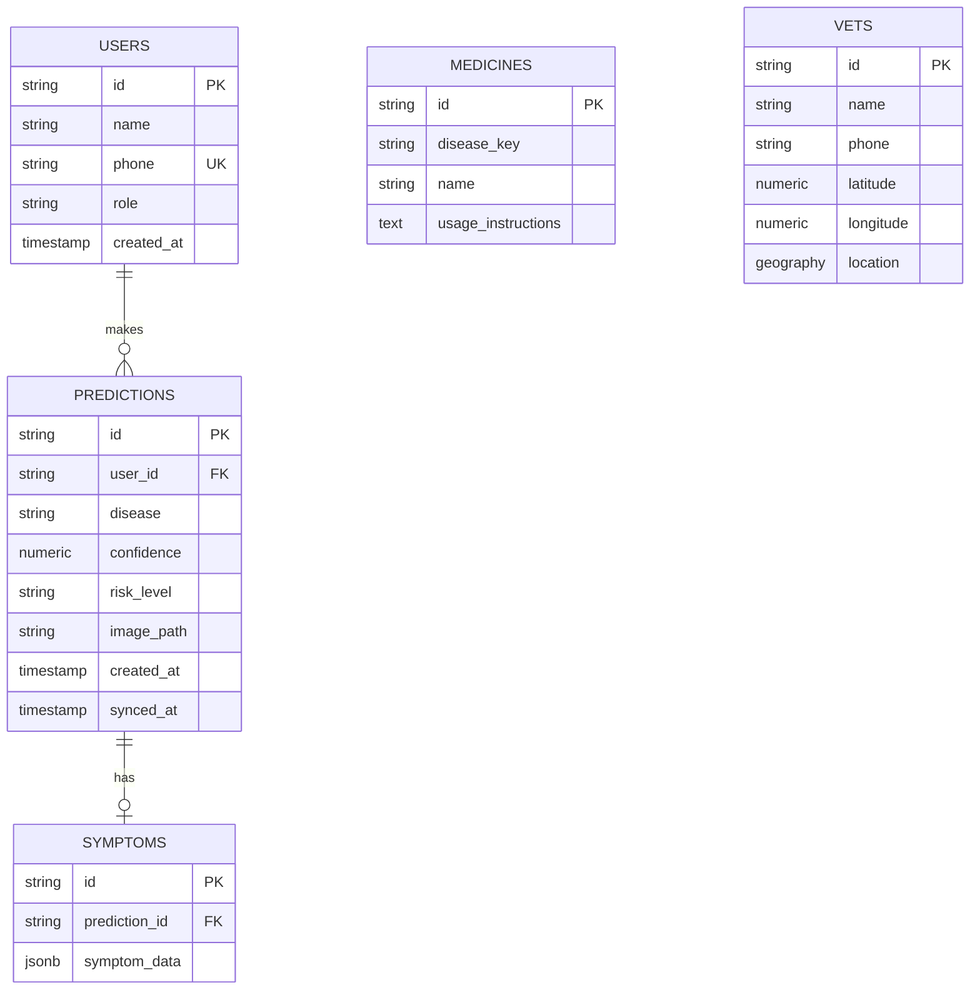

# Database Schema & Design

## 1. Entity-Relationship Diagram



## 2. Prisma Schema
```prisma
datasource db {
  provider  = "postgresql"
  url       = env("DATABASE_URL")   // pooled connection (PgBouncer, port 6543)
  directUrl = env("DIRECT_URL")     // direct connection, used only for migrations
}
 
generator client {
  provider = "prisma-client-js"
}
 
enum Role {
  FARMER
  VET
  ADMIN
}
 
model User {
  id          String   @id @default(uuid())
  name        String
  phone       String   @unique
  role        Role     @default(FARMER)
  createdAt   DateTime @default(now())
  predictions Prediction[]
}
 
model Prediction {
  id          String    @id @default(uuid())
  userId      String
  user        User      @relation(fields: [userId], references: [id])
  disease     String
  confidence  Decimal
  riskLevel   String
  imagePath   String?   // Supabase Storage object path, not a bare URL
  createdAt   DateTime  @default(now())
  syncedAt    DateTime?
  symptom     Symptom?
  @@index([userId])
}
 
model Symptom {
  id            String     @id @default(uuid())
  predictionId  String     @unique
  prediction    Prediction @relation(fields: [predictionId], references: [id], onDelete: Cascade)
  symptomData   Json
}
 
model Medicine {
  id                 String @id @default(uuid())
  diseaseKey         String
  name               String
  usageInstructions  String
}
 
model Vet {
  id        String  @id @default(uuid())
  name      String
  phone     String
  latitude  Float
  longitude Float
  // PostGIS geography column -- Prisma has no native geo type
  location  Unsupported("geography(Point, 4326)")?
}
```

## 3. PostGIS Query (Prisma Raw SQL)
Prisma Client has no query builder for geography types. The location column is declared Unsupported(...) so migrations can create it, but nearby-vet lookups must go through raw SQL. A GIST index on location is mandatory — without it this query becomes a full table scan.
```javascript
const nearbyVets = await prisma.$queryRaw`
  SELECT id, name, phone,
    ST_Distance(location, ST_MakePoint(${lng}, ${lat})::geography) AS distance_m
  FROM "Vet"
  WHERE ST_DWithin(location, ST_MakePoint(${lng}, ${lat})::geography, 25000)
  ORDER BY distance_m
  LIMIT 10;
`;
```

## 4. Row-Level Security Policies
```sql
alter table "Prediction" enable row level security;
 
create policy "Users see only their own predictions"
on "Prediction" for select
using (auth.uid()::text = "userId");
 
create policy "Admins see everything"
on "Prediction" for select
using (exists (
  select 1 from "User" u where u.id = auth.uid()::text and u.role = 'ADMIN'
));
```
